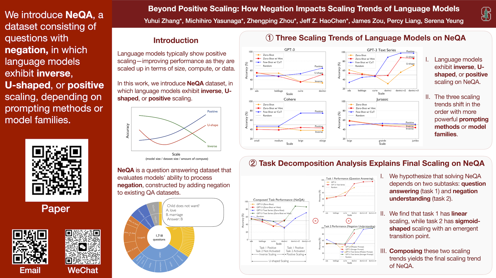

# Beyond Positive Scaling: How Negation Impacts Scaling Trends of Language Models

[](https://sites.google.com/view/neqa)
[](https://lbesson.mit-license.org/)
[](https://www.python.org/downloads/release/python-3100/)
[](https://pytorch.org/get-started/previous-versions/#v112)
[](https://github.com/ambv/black)

This repo provides the PyTorch source code of our paper: 
[Beyond Positive Scaling: How Negation Impacts Scaling Trends of Language Models](.) (Findings of ACL 2023)

## Abstract

Language models have been shown to exhibit positive scaling, where performance improves as models are scaled up in terms of size, compute, or data. In this work, we introduce NeQA, a dataset consisting of questions with negation in which language models do not exhibit straightforward positive scaling. We show that this task can exhibit inverse scaling, U-shaped scaling, or positive scaling, and the three scaling trends shift in this order as we use more powerful prompting methods or model families. We hypothesize that solving NeQA depends on two subtasks: question answering (task 1) and negation understanding (task 2). We find that task 1 has linear scaling, while task 2 has sigmoid-shaped scaling with an emergent transition point, and composing these two scaling trends yields the final scaling trend of NeQA. Our work reveals and provides a way to analyze the complex scaling trends of language models.

## Video


## Poster


## Repo Organization

- [Dataset](data_pipeline/neqa.jsonl)
  - `cd data_pipeline`
  - Dataset (statistics in Figure 3): `neqa.jsonl`

- [Main Paper Results](eval_pipeline/)
  - `cd eval_pipeline`
  - Reproduce scaling trends of various language models (Figure 2): `run.sh`
  - Reproduce task decomposition analysis (Figure 4): `run.sh`

- [Appendix Results](simulation/)
  - `cd simulation`
  - Reproduce task decomposition simulation (Figure 5): `task_decompose.py`
  - Reproduce fine-tuning simulation (Figure 6): `train.py` and `eval.py`

## Citation
If you use this repo in your research, please cite it as follows:
```
@inproceedings{
  zhang2023beyond,
  title={Beyond Positive Scaling: How Negation Impacts Scaling Trends of Language Models},
  author={Yuhui Zhang and Michihiro Yasunaga and Zhengping Zhou and Jeff Z. HaoChen and James Zou and Percy Liang and Serena Yeung},
  booktitle={Findings of the Association for Computational Linguistics (ACL Findings)},
  year={2023}
}
```


